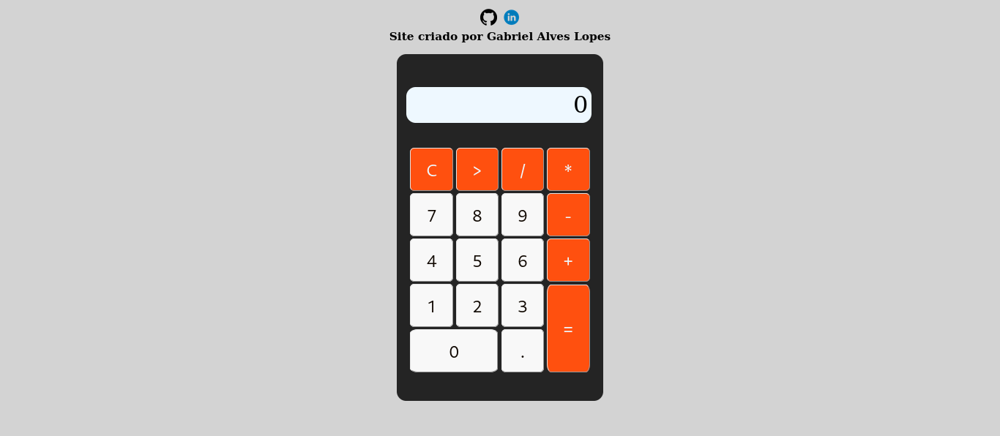

# Calculadora



[`Clique para visitar o projeto`](https://calculadora-gabrielgal.vercel.app)

## Descrição

A **Calculadora** é um projeto que simula o funcionamento de uma calculadora de forma prática e intuitiva. Com uma interface simples e funcional, você pode realizar operações básicas como adição, subtração, multiplicação e divisão em poucos cliques! Este site foi desenvolvido utilizando HTML, CSS e JavaScript, com base nos conceitos fundamentais de programação web.

## Tecnologias Usadas

- **HTML** : Linguagem de marcação utilizada para estruturar o conteúdo do site.
- **CSS** : Utilizado para estilizar a interface, deixando-a atraente e funcional.
- **JavaScript** : Linguagem de programação responsável pela lógica e interatividade da calculadora.

## Funcionalidades

- Simulação de uma calculadora funcional.
- Realização de operações básicas: adição, subtração, multiplicação e divisão.
- Interface simples e intuitiva.

## Como Usar

### 1. Clone o repositório:

```bash
git clone https://github.com/seu-usuario/calculadora.git
```

### 2. Acesse o diretório do projeto:

```bash
cd calculadora
```

### 3. Instale as dependências:

```bash
npm install
```


### 4. Execute o servidor de desenvolvimento:

```bash
npm run dev
```

### 5. Acesse o projeto no navegador: http://localhost:3000